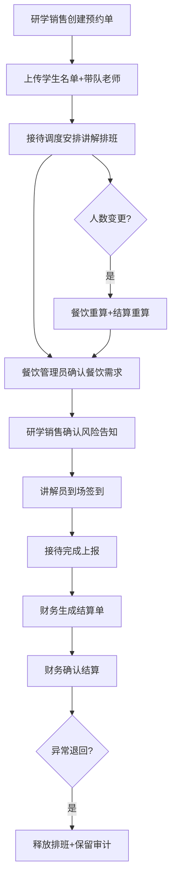

## 1. 产品概述

景区研学团队接待管理系统，面向研学旅行场景下的全流程数字化管理平台。覆盖从团队预约、名单管理、讲解排班、餐饮确认、到场签到、接待完成到结算生成的端到端业务链路，同时支持异常退回和全链路操作审计。

- **核心价值**：解决研学接待中多角色协同混乱、排班冲突、费用结算不准确、风险告知缺失等痛点
- **目标用户**：研学销售、接待调度、讲解员、餐饮管理员、财务结算五大专属角色

## 2. 核心功能

### 2.1 用户角色

| 角色 | 注册方式 | 核心权限 |
|------|-----------|----------|
| 研学销售 | 系统预置/管理员创建 | 团队预约创建、编辑，学校信息维护，名单上传，风险告知确认 |
| 接待调度 | 管理员创建 | 讲解时段管理、讲解员排班、餐饮需求确认、接待状态流转、异常退回处理 |
| 讲解员 | 管理员创建 | 个人排班查看、接待签到执行、接待完成上报 |
| 餐饮管理员 | 管理员创建 | 餐饮需求确认、人数变更后餐饮重算 |
| 财务结算 | 管理员创建 | 结算单生成、金额确认、结算状态管理 |

### 2.2 功能模块

1. **登录认证模块**：账号登录、角色权限控制、会话管理
2. **预约管理模块**：预约单 CRUD、学校信息管理、带队老师管理
3. **名单管理模块**：学生名单上传、人数统计、变更记录
4. **讲解排班模块**：讲解时段配置、讲解员排班、排班冲突检测
5. **餐饮管理模块**：餐饮需求录入、人数变更重算、餐饮确认
6. **签到接待模块**：风险告知确认、到场签到、接待完成
7. **结算管理模块**：结算单自动生成、金额计算、结算确认
8. **操作审计模块**：全链路操作日志、变更追溯
9. **异常处理模块**：接待取消、排班释放、异常退回
10. **首页看板模块**：各角色数据概览、待办提醒

### 2.3 页面详情

| 页面名称 | 模块名称 | 功能描述 |
|----------|----------|-------------|
| 登录页 | 登录表单 | 账号密码登录、角色选择展示 |
| 首页看板 | 数据概览卡片 | 各角色专属统计数据、待办事项列表 |
| 预约管理 | 预约列表 | 预约单搜索、筛选、查看详情 |
| 预约管理 | 预约创建/编辑 | 预约信息录入、学校选择、带队老师录入 |
| 预约管理 | 名单上传 | 学生名单 Excel/手动录入、人数校验 |
| 讲解排班 | 时段管理 | 讲解时段增删改查 |
| 讲解排班 | 排班管理 | 按团队分配讲解员、冲突检测、并发占用处理 |
| 餐饮管理 | 餐饮列表 | 餐饮需求列表、确认状态 |
| 餐饮管理 | 餐饮编辑 | 餐饮标准配置、人数重算 |
| 签到接待 | 签到列表 | 待签到团队、风险告知状态 |
| 签到接待 | 签到执行 | 风险告知确认、到场签到 |
| 结算管理 | 结算列表 | 结算单列表、金额展示 |
| 结算管理 | 结算确认 | 金额明细、确认/退回 |
| 审计日志 | 日志列表 | 全链路操作日志、变更对比 |
| 异常管理 | 异常列表 | 异常退回、取消记录 |

## 3. 核心流程

**关键业务约束链路：
1. 排班前必须已上传名单 → 否则拦截确认接待
2. 排班时检测讲解员时段重叠 → 返回稳定业务错误
3. 名单人数变更 → 触发餐饮、结算自动重算
4. 取消已确认接待 → 释放讲解员时段 + 写入审计日志
5. 签到前必须完成风险告知 → 否则拦截签到
6. 结算确认仅限财务角色 → 权限校验

## 4. 用户界面设计

### 4.1 设计风格

- **主色调**：深青绿色系（#0F766E），契合研学、自然、教育的氛围
- **辅助色**：琥珀色（#D97706）用于重要警示，用于风险告知、异常状态
- **中性色**：Slate 灰阶体系
- **按钮风格**：圆角 8px，hover 有轻微阴影和颜色加深
- **字体**：中文用 PingFang SC / 思源黑体，标题加粗，正文常规
- **布局风格**：左侧导航 + 顶部工具栏 + 内容卡片式布局
- **图标**：Lucide 图标库，线性风格

### 4.2 页面设计概览

| 页面名称 | 模块名称 | UI 元素 |
|----------|----------|----------|
| 登录页 | 登录表单 | 居中卡片、logo区域+表单区、角色切换Tab |
| 首页看板 | 数据概览 | 顶部4张统计卡片+待办列表+快捷入口 |
| 列表类页面 | 表格 | 顶部搜索筛选工具栏+数据表格+行操作 |
| 表单类页面 | 表单 | 分区折叠+分步步骤条 |
| 排班页面 | 排班面板 | 讲解员时间轴视图+冲突高亮提示 |

### 4.3 响应式

桌面端优先设计，支持平板自适应；移动端核心页面（签到、排班查看）适配触摸操作。

### 4.4 交互细节

- 排班冲突时弹出明确的业务错误提示，带具体冲突时段信息
- 名单上传后实时显示人数统计
- 金额变更后餐饮/结算自动重算时显示加载提示
- 所有重要操作前二次确认
- 操作成功/失败使用统一 Toast 提示
