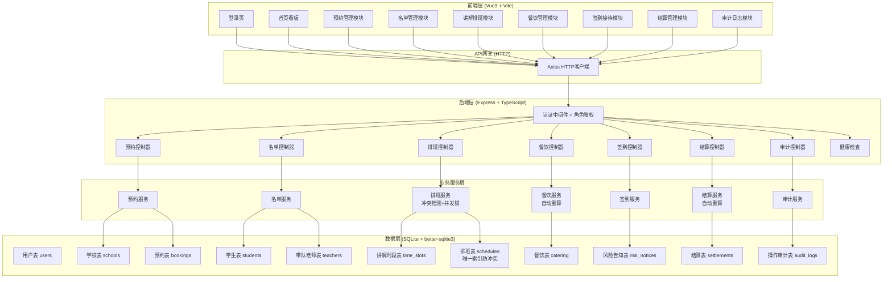
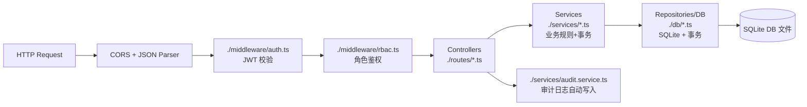

## 1. 架构设计



## 2. 技术描述

- **前端**：Vue@3.4 + TypeScript + Vue Router@4 + Pinia@2 + TailwindCSS@3 + Lucide Icons + Vite@5
- **后端**：Express@4 + TypeScript + better-sqlite3 + JWT + bcryptjs + zod 校验
- **数据库**：SQLite 本地文件数据库（better-sqlite3 同步驱动，零配置）
- **认证**：JWT Token + 角色 RBAC 权限控制
- **并发控制**：数据库事务 + 唯一索引 + SELECT ... FOR UPDATE 语义

## 3. 路由定义

| 前端路由 | 页面/组件 | 权限角色 |
|-----------|-----------|-----------|
| `/login` | 登录页 | 公开 |
| `/dashboard` | 首页看板 | 全部登录用户 |
| `/bookings` | 预约列表 | 研学销售/接待调度/财务 |
| `/bookings/new` | 创建预约 | 研学销售 |
| `/bookings/:id` | 预约详情 | 全部相关角色 |
| `/bookings/:id/students` | 名单上传 | 研学销售 |
| `/schedules` | 排班管理 | 接待调度 |
| `/schedules/guide/:id` | 排班视图 | 接待调度/讲解员 |
| `/catering` | 餐饮管理 | 餐饮管理员/接待调度 |
| `/checkin` | 签到接待 | 讲解员/接待调度 |
| `/settlements` | 结算列表 | 财务结算 |
| `/settlements/:id` | 结算详情 | 财务结算 |
| `/audit` | 审计日志 | 全部登录用户 |

## 4. API 定义

### 4.1 认证 API

```typescript
// POST /api/auth/login
interface LoginReq { username: string; password: string }
interface LoginRes {
  token: string;
  user: { id: string; username: string; name: string; role: UserRole };
}

// GET /api/auth/me  (鉴权中间件保护)
interface MeRes { id: string; username: string; name: string; role: UserRole }
```

### 4.2 健康检查

```typescript
// GET /api/health
interface HealthRes {
  status: "ok" | "error";
  database: "connected" | "disconnected";
  timestamp: number;
}
```

### 4.3 预约 API

```typescript
type BookingStatus = "draft" | "list_uploaded" | "scheduled" | "catering_confirmed" | "risk_confirmed" | "checked_in" | "completed" | "settled" | "cancelled";

// POST /api/bookings
interface CreateBookingReq {
  school_id: string;
  visit_date: string;
  expected_student_count: number;
  teacher_count: number;
  contact_name: string;
  contact_phone: string;
  notes?: string;
}
interface BookingRes { id: string; status: BookingStatus; ... }

// GET /api/bookings  (支持筛选)
// GET /api/bookings/:id
// PUT /api/bookings/:id
// DELETE /api/bookings/:id  (软删除/取消)
```

### 4.4 名单 API

```typescript
// POST /api/bookings/:id/students  (批量上传/更新名单)
interface UploadStudentsReq {
  students: Array<{ name: string; gender?: string; grade?: string; id_card?: string }>;
  teachers: Array<{ name: string; phone?: string }>;
}
interface UploadStudentsRes {
  student_count: number;
  teacher_count: number;
  total_count: number;
  recalculated: boolean;  // 触发重算标记
}

// GET /api/bookings/:id/students
```

### 4.5 排班 API

```typescript
// POST /api/schedules  (排班，核心约束：时段不重叠)
interface CreateScheduleReq {
  booking_id: string;
  guide_id: string;
  time_slot_id: string;
  start_time: string;  // ISO datetime
  end_time: string;    // ISO datetime
  route_notes?: string;
}
// 业务错误响应：
// { code: "SCHEDULE_CONFLICT", message: "该讲解员在 [时段] 已有排班", conflict_schedule?: {...} }
// { code: "DUPLICATE_SUBMIT", message: "请勿重复提交排班" }
// { code: "NO_STUDENT_LIST", message: "请先上传学生名单后再排班" }

// GET /api/schedules  (支持按讲解员/日期筛选)
// DELETE /api/schedules/:id  (取消排班/释放时段，写入审计)
```

### 4.6 餐饮 API

```typescript
// PUT /api/bookings/:id/catering
interface UpdateCateringReq {
  meal_standard: number;       // 人均餐标
  meal_type: "lunch" | "dinner" | "both";
  extra_requirements?: string;
}
interface CateringRes {
  student_meal_cost: number;
  teacher_meal_cost: number;
  total_meal_cost: number;
  confirmed: boolean;
}

// POST /api/bookings/:id/catering/confirm  (餐饮管理员确认)
```

### 4.7 签到 API

```typescript
// POST /api/bookings/:id/risk-notice  (风险告知确认，销售操作)
interface ConfirmRiskReq {
  signatory: string;    // 签字人
  confirmed_at: string;
  notes?: string;
}

// POST /api/bookings/:id/checkin  (到场签到，讲解员操作)
interface CheckinReq {
  actual_student_count: number;
  actual_teacher_count: number;
  checkin_time: string;
}
// 错误响应: { code: "RISK_NOT_CONFIRMED", message: "请先完成风险告知确认" }

// POST /api/bookings/:id/complete  (接待完成上报)
```

### 4.8 结算 API

```typescript
// POST /api/bookings/:id/settlement/generate  (生成/重算结算单)
interface GenerateSettlementRes {
  id: string;
  guide_fee: number;        // 讲解费用
  catering_fee: number;     // 餐饮费用
  ticket_fee: number;       // 门票费用
  other_fee: number;
  total_amount: number;
  details: Array<{ item: string; count: number; unit_price: number; subtotal: number }>;
}

// POST /api/settlements/:id/confirm  (财务确认)
// 错误: { code: "PERMISSION_DENIED", message: "仅有财务角色可确认结算" }
```

## 5. 服务端架构



## 6. 数据模型

### 6.1 ER 图

```mermaid
erDiagram
    users {
        TEXT id PK
        TEXT username UK
        TEXT password_hash
        TEXT name
        TEXT role
        TEXT created_at
    }

    schools {
        TEXT id PK
        TEXT name
        TEXT contact_person
        TEXT contact_phone
        TEXT address
    }

    bookings {
        TEXT id PK
        TEXT school_id FK
        TEXT created_by FK "sales user"
        TEXT visit_date
        INTEGER expected_student_count
        INTEGER actual_student_count
        INTEGER teacher_count
        TEXT status
        TEXT contact_name
        TEXT contact_phone
        TEXT notes
        TEXT created_at
        TEXT updated_at
    }

    students {
        TEXT id PK
        TEXT booking_id FK
        TEXT name
        TEXT gender
        TEXT grade
        TEXT id_card
    }

    teachers {
        TEXT id PK
        TEXT booking_id FK
        TEXT name
        TEXT phone
    }

    time_slots {
        TEXT id PK
        TEXT name "上午场/下午场等"
        TEXT start_time "HH:mm"
        TEXT end_time "HH:mm"
        INTEGER capacity
    }

    schedules {
        TEXT id PK
        TEXT booking_id FK
        TEXT guide_id FK "users.role=guide"
        TEXT time_slot_id FK
        TEXT start_datetime
        TEXT end_datetime
        TEXT route_notes
        TEXT created_at
    }

    catering {
        TEXT id PK
        TEXT booking_id FK UK
        REAL meal_standard
        TEXT meal_type
        REAL student_meal_cost
        REAL teacher_meal_cost
        REAL total_meal_cost
        INTEGER confirmed BOOLEAN
        TEXT confirmed_by FK
        TEXT confirmed_at
    }

    risk_notices {
        TEXT id PK
        TEXT booking_id FK UK
        TEXT signatory
        TEXT confirmed_at
        TEXT notes
    }

    settlements {
        TEXT id PK
        TEXT booking_id FK UK
        REAL guide_fee
        REAL catering_fee
        REAL ticket_fee
        REAL other_fee
        REAL total_amount
        TEXT status "draft/confirmed/cancelled"
        TEXT confirmed_by FK
        TEXT confirmed_at
    }

    audit_logs {
        INTEGER id PK
        TEXT user_id FK
        TEXT action
        TEXT entity_type
        TEXT entity_id
        TEXT before_data "JSON"
        TEXT after_data "JSON"
        TEXT created_at
    }

    users ||--o{ bookings : "created_by"
    schools ||--o{ bookings : ""
    bookings ||--o{ students : ""
    bookings ||--o{ teachers : ""
    bookings ||--o| catering : ""
    bookings ||--o| risk_notices : ""
    bookings ||--o| settlements : ""
    bookings ||--o{ schedules : ""
    schedules }o--|| users : "guide_id"
    schedules }o--|| time_slots : ""
    audit_logs }o--|| users : ""
```

### 6.2 DDL

```sql
-- users 表
CREATE TABLE IF NOT EXISTS users (
  id TEXT PRIMARY KEY,
  username TEXT UNIQUE NOT NULL,
  password_hash TEXT NOT NULL,
  name TEXT NOT NULL,
  role TEXT NOT NULL CHECK (role IN ('sales', 'dispatcher', 'guide', 'catering_admin', 'finance')),
  created_at TEXT DEFAULT (datetime('now'))
);

-- schools 表
CREATE TABLE IF NOT EXISTS schools (
  id TEXT PRIMARY KEY,
  name TEXT NOT NULL,
  contact_person TEXT,
  contact_phone TEXT,
  address TEXT
);

-- bookings 表
CREATE TABLE IF NOT EXISTS bookings (
  id TEXT PRIMARY KEY,
  school_id TEXT NOT NULL REFERENCES schools(id),
  created_by TEXT NOT NULL REFERENCES users(id),
  visit_date TEXT NOT NULL,
  expected_student_count INTEGER NOT NULL DEFAULT 0,
  actual_student_count INTEGER,
  teacher_count INTEGER NOT NULL DEFAULT 0,
  status TEXT NOT NULL DEFAULT 'draft' CHECK (status IN ('draft','list_uploaded','scheduled','catering_confirmed','risk_confirmed','checked_in','completed','settled','cancelled')),
  contact_name TEXT,
  contact_phone TEXT,
  notes TEXT,
  created_at TEXT DEFAULT (datetime('now')),
  updated_at TEXT DEFAULT (datetime('now'))
);
CREATE INDEX idx_bookings_visit_date ON bookings(visit_date);
CREATE INDEX idx_bookings_status ON bookings(status);

-- students 表
CREATE TABLE IF NOT EXISTS students (
  id TEXT PRIMARY KEY,
  booking_id TEXT NOT NULL REFERENCES bookings(id) ON DELETE CASCADE,
  name TEXT NOT NULL,
  gender TEXT,
  grade TEXT,
  id_card TEXT
);
CREATE INDEX idx_students_booking ON students(booking_id);

-- teachers 表
CREATE TABLE IF NOT EXISTS teachers (
  id TEXT PRIMARY KEY,
  booking_id TEXT NOT NULL REFERENCES bookings(id) ON DELETE CASCADE,
  name TEXT NOT NULL,
  phone TEXT
);

-- time_slots 表
CREATE TABLE IF NOT EXISTS time_slots (
  id TEXT PRIMARY KEY,
  name TEXT NOT NULL,
  start_time TEXT NOT NULL,
  end_time TEXT NOT NULL,
  capacity INTEGER DEFAULT 50
);

-- schedules 表 (关键：并发冲突控制)
CREATE TABLE IF NOT EXISTS schedules (
  id TEXT PRIMARY KEY,
  booking_id TEXT NOT NULL REFERENCES bookings(id),
  guide_id TEXT NOT NULL REFERENCES users(id),
  time_slot_id TEXT REFERENCES time_slots(id),
  start_datetime TEXT NOT NULL,
  end_datetime TEXT NOT NULL,
  route_notes TEXT,
  created_at TEXT DEFAULT (datetime('now'))
);
CREATE INDEX idx_schedules_guide_time ON schedules(guide_id, start_datetime, end_datetime);
-- 业务层面冲突检测 + 事务锁定

-- catering 表
CREATE TABLE IF NOT EXISTS catering (
  id TEXT PRIMARY KEY,
  booking_id TEXT UNIQUE NOT NULL REFERENCES bookings(id),
  meal_standard REAL NOT NULL DEFAULT 0,
  meal_type TEXT DEFAULT 'lunch',
  student_meal_cost REAL DEFAULT 0,
  teacher_meal_cost REAL DEFAULT 0,
  total_meal_cost REAL DEFAULT 0,
  confirmed INTEGER DEFAULT 0,
  confirmed_by TEXT REFERENCES users(id),
  confirmed_at TEXT
);

-- risk_notices 表
CREATE TABLE IF NOT EXISTS risk_notices (
  id TEXT PRIMARY KEY,
  booking_id TEXT UNIQUE NOT NULL REFERENCES bookings(id),
  signatory TEXT NOT NULL,
  confirmed_at TEXT NOT NULL,
  notes TEXT
);

-- settlements 表
CREATE TABLE IF NOT EXISTS settlements (
  id TEXT PRIMARY KEY,
  booking_id TEXT UNIQUE NOT NULL REFERENCES bookings(id),
  guide_fee REAL DEFAULT 0,
  catering_fee REAL DEFAULT 0,
  ticket_fee REAL DEFAULT 0,
  other_fee REAL DEFAULT 0,
  total_amount REAL DEFAULT 0,
  details_json TEXT,
  status TEXT DEFAULT 'draft' CHECK (status IN ('draft','confirmed','cancelled')),
  confirmed_by TEXT REFERENCES users(id),
  confirmed_at TEXT
);

-- audit_logs 表
CREATE TABLE IF NOT EXISTS audit_logs (
  id INTEGER PRIMARY KEY AUTOINCREMENT,
  user_id TEXT NOT NULL REFERENCES users(id),
  action TEXT NOT NULL,
  entity_type TEXT NOT NULL,
  entity_id TEXT NOT NULL,
  before_data TEXT,
  after_data TEXT,
  created_at TEXT DEFAULT (datetime('now'))
);
CREATE INDEX idx_audit_entity ON audit_logs(entity_type, entity_id);
CREATE INDEX idx_audit_user ON audit_logs(user_id);
```
